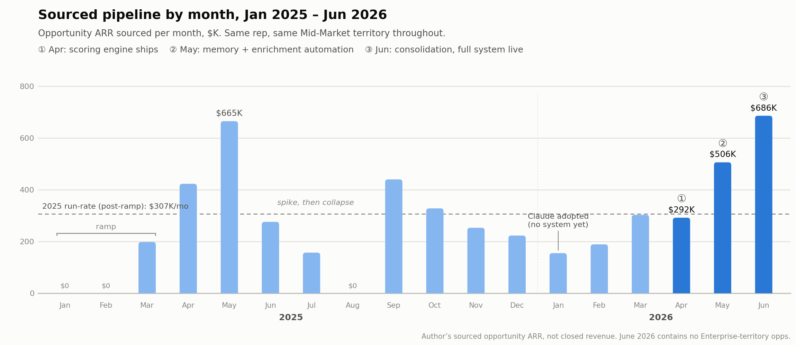

# GTM AI Engine

**An AI-native prospecting system built on Claude.** Designed, built, and run in production by Ayman Abdalla at HiBob (Bob, a modern HRIS/HCM).  
  
Claude arrived mid-January 2026; the system was designed and shipped across Q2 2026 on a Mid-Market book in the org's toughest territory. Its first quarter live was the best sourcing quarter in the author's 18-month record and anchored the case for promotion into Enterprise (July 2026), where it now runs a growing named territory (75 accounts at handoff, 200 today). In production across the 18-rep US BDR org and shared with EMEA BDR managers, with handoff documentation for region-tailored replication.

The system turns Claude into the operating layer for a full outbound motion: account qualification, lookalike sourcing, live enrichment, buying-committee mapping, benchmark-grounded copy, sequence state tracking, persistent memory, and unattended scheduled automation. It is built entirely from version-controlled agent skills (markdown-defined behaviors with explicit triggers, precedence rules, and guardrails), MCP connectors, and scheduled cloud sessions. The design goal: let one rep work a full territory book like it's a fraction of its size, with rep time going to judgment and conversations instead of busywork.

> Portfolio note: scoring rubrics, thresholds, customer references, and all prospect data are abstracted here. Nothing proprietary appears in this repo.

**Repo guide:** [`docs/ARCHITECTURE.md`](docs/ARCHITECTURE.md) — the seven layers, skill governance, memory design, and trust boundaries · [`docs/OPERATIONS.md`](docs/OPERATIONS.md) — how it runs day to day · [`docs/REPLICATION.md`](docs/REPLICATION.md) — how 18 reps and an EMEA org adopted it · [`skills/`](skills/) — full template recreations of three production skills · [`examples/`](examples/) — synthetic outputs generated by the production skills against a fictional account.

---


## The problem

The BDR org's biggest bottleneck was bad account data: wrong employee counts, wrong territories, non-ICP and bad-fit accounts sitting in every book. The cost was daily. Reps spent 2-3 hours a day cleaning their book and pulling bad accounts out of their name before any real prospecting started. Mapping a buying committee took another 10-20 minutes per account and still came out generic, with little to no personalization. And there was no dependable answer to the question that matters most: which accounts should I work first, and why?

Underneath that, four engineering constraints shaped the build, and each got a control instead of a prompt hack:

- **CRM intent scores were noisy.** The system ignores them by rule and grades every account fresh, against evidence.
- **Uploaded account lists lie.** Headcounts wrong by 10x, absorbed subsidiaries, defunct records. So scoring is gated behind live verification.
- **No integration available for the sequencing platform.** Enterprise environments lock down tooling. Rather than lose sequence state, the system rebuilds it from the rep's own activity reports and reconciles it daily, working entirely within the approved stack.
- **LLMs fabricate proof.** So customer evidence is only ever selected from a curated bank, never generated.

---


## Impact and adoption

- **Pipeline pace roughly doubled in the system's first quarter live.** The mature 2025 baseline, excluding three ramp months, was $307K/month in sourced opportunity ARR. The quarter before the build ran $216K/month. The system shipped in phases across Apr-Jun 2026 (scoring in April, memory and enrichment automation in May, consolidation in June) and the quarter ran $495K/month: 1.6x the mature baseline, 2.3x the quarter immediately prior, 2.0x the full-2025 monthly average. June's $686K was the best month in the 18-month record, set while the author was simultaneously handing off the Mid-Market book ahead of the Enterprise move. ($5.09M total sourced across 18 months. Author's own sourced pipeline, not the org's; opportunity ARR, not closed revenue.)
- **A built-in control group: Claude alone changed nothing.** The author had full Claude access from mid-January 2026, ten weeks before the system existed. Pace in that no-system stretch sat 30% below the 2025 run-rate. The lift arrived with the build, phase by phase: $292K in April, $506K in May, $686K in June. The engineering was the variable, not the tool.
- **The shape of the pipeline changed, not just the level.** 2025 was feast-and-famine: a $665K May, then $276K, $157K, and a $0 August, with three $0 months across the year. 2026 rose in five of six months, never fell below $155K, and was still accelerating at the record when the segment switch closed the series.



- **Book cleanup went from 2-3 hours a day to 10-20 minutes.** The scorer's list triage does the verifying, grading, and DQ work reps did by hand, and hands back the remove list directly.
- **Committee mapping went from 10-20 minutes of generic output to a full personalized account plan.** Who to approach, at what altitude, with what angle, backed by which proof, and why now, so reps know exactly how to sell HRIS into the account.
- **Prioritization stopped being guesswork.** Every account now carries a verdict and a ranked priority with the reasons attached, so reps know exactly which accounts to work and why.
- **The DQ discipline shows up in real decisions.** An inherited 305-account book audit produced just 31 claims; a 2,724-row contact export was reclassified into a five-role buying-committee taxonomy; and daily contact verification exists because the first senior-first batch found roughly half of senior contacts stale.
- **Adopted across the US BDR org (18 reps)** and shared with BDR managers in EMEA, with handoff documentation so each region can replicate it tailored to their team and market. Adoption has two paths, including one where Claude interviews the adopting rep and rewrites the skills for their own territory before install — the skills are self-customizing distribution ([REPLICATION.md](docs/REPLICATION.md)).
- **Pushed upstream to fix the root cause.** The workflow was presented to RevOps and BDR leadership, making the case for RevOps to adopt the same trigger criteria in account assignment so reps are handed better books in the first place.
- **And it helped carry a promotion.** The results above anchored the author's written case for the Enterprise BDR role; the move came in July 2026, and the system moved into the new segment with him.

From the BDR team lead on the author's team, after adopting the workflow:

> "I'd say it saved me hours, maybe even days, of cleaning up accounts and checking to see if they're even the right fit or find a few brief facts on them, increasing efficiency so we can focus on outbounding and optimizing our book to the best of our ability."

---


## System map

```
┌────────────────────────────────────────────────────────────────┐
│  SCHEDULED AUTOMATION   5-task weekday cascade · checkpoints   │
├────────────────────────────────────────────────────────────────┤
│  WORKFLOW SKILLS                                               │
│  account-scorer → lookalike engine → outreach/committee engine │
│  → copy protocols (persona-routed) → sequence tracker          │
│  intel auto-capture runs underneath every interaction          │
├────────────────────────────────────────────────────────────────┤
│  DATA LAYER (MCP + web)                                        │
│  ZoomInfo · Common Room · live web research · Gmail · Calendar │
├────────────────────────────────────────────────────────────────┤
│  MEMORY                                                        │
│  mem0 (shared, governed) · account pages · structured book     │
└────────────────────────────────────────────────────────────────┘
```

---


## Core components


### 1. Account Scorer

The qualification engine and single source of truth for "is this account a fit and should we work it." Three modes: full list triage (territory, unassigned lists, or a teammate's book), single-account qualification for meeting prep, and re-scoring when new intel lands.

Key design decisions:

- **Live-research gate.** No account is graded off the uploaded file. Headcount, industry, workforce type, current HRIS, and ownership are verified against live sources first; most bad grades trace to trusting the file.
- **Two independent fit lenses.** Company/product fit and payroll-product fit are scored separately and never allowed to drag each other down, because they answer different questions.
- **Two axes, kept visible.** FIT (how much the account resembles customers actually won) and WIN (triggers, displaceable stack, in-market intent, access) are scored separately, then combined into priority. An in-market non-fit never sneaks into the pipeline.
- **DQ is a first-class outcome.** A hard disqualification taxonomy (absorbed subsidiaries, wrong workforce type, junk records, out-of-band size) removes accounts instead of parking them in "maybe."
- **Deliverables reps actually use.** Color-coded Excel triage, a grouped doc with tailored discovery questions for every borderline account, and per-account pages.

The current standard was hardened through a three-way bake-off: three competing scoring approaches were run against the same books and the best mechanics of each were consolidated. A v2 is now spec'd as a standalone product, with a formal scoring spec and a backtest harness that doubles as an eval benchmark for future model revisions.

### 2. Lookalike engine

Fit is grounded in won customers, not abstract points, in two directions:

- **Inbound (scoring):** every account is pattern-matched against a set of eight lookalike profiles distilled from real won customers (for example "outgrown their SMB HRIS," "post-funding headcount rocket," "tool sprawl"). Every scored account must name its matched profile plus the closest real customer, band-matched, never repeated across unrelated accounts, and never fabricated. If no honest match exists, the system says so.
- **Outbound (sourcing):** ZoomInfo's similarity engine is seeded with won customers to generate ranked lookalike lists of net-new accounts, which flow straight into the scorer for triage.


### 3. ZoomInfo integration

A live data layer over the ZoomInfo MCP connector: company and contact enrichment, intent signals, news and scoops, tech-stack detection, and find-similar, all pulled on demand inside the workflow instead of via CSV exports. The system is deliberately source-agnostic: when ZoomInfo access was pulled mid-stream for a period, the skills degraded gracefully to web research plus Common Room without changing any downstream behavior, then re-absorbed ZoomInfo when it returned.

### 4. Scheduled automation

Recurring sessions that run unattended before the workday: a five-task weekday cascade in deliberate order — intent radar and the weekly attack pack on Mondays, then inbox hygiene, enrichment of the stalest accounts, and contact verification daily — each task feeding the next through shared, dated segment tags in the data layer. The verification task exists because the first batch measured ~50% staleness among senior contacts, and it is self-terminating: at zero remaining it recommends disabling itself. A styled HTML **morning brief** renders the result, with every "needs attention" item verified as still open before it lands. All of it runs inside hard boundaries: connectors and search only, draft-and-notify, stop-and-report on any failure — nothing sends autonomously. Full cascade detail in [OPERATIONS.md](docs/OPERATIONS.md); a synthetic render is in [examples/](examples/).

### 5. The skill ecosystem

A dozen custom skills with single responsibilities and explicit hand-offs. The core ones:


| Skill                             | Job                                                                                                                                                                                                                                 |
| --------------------------------- | ---------------------------------------------------------------------------------------------------------------------------------------------------------------------------------------------------------------------------------- |
| account-scorer                    | Fit, priority, DQ, discovery questions                                                                                                                                                                                              |
| hibob-outreach                    | Account plans + 8-12 seat buying-committee maps, per-seat search strings and angles, single-thread risk flags                                                                                                                       |
| lavender-core + persona protocols | Copy engine encoding Lavender's published benchmark research (231k+ cold emails) into enforceable rules; a router dispatches each message to the persona-matched protocol (HR, finance, IT, ops) with altitude matched to seniority |
| hibob-proof-bank                  | Selects one band-matched customer proof per message; never a smaller-band logo to a larger prospect, never an invented quote                                                                                                        |
| hibob-payroll-qualifier           | Standalone payroll-fit verdicts and discovery questions                                                                                                                                                                             |
| aym-sequence-tracker              | Per-prospect sequence state registry; every draft is logged, and DRAFTED is never treated as SENT until reconciled against end-of-day activity reports                                                                              |
| core-intel-logger                 | Background capture layer: every profile read, call disposition, and reply is written to account pages and a structured book with a shared tag taxonomy the other skills consume                                                     |
| morning / strategy-handoff        | The weekday brief and structured decision hand-offs to a second agent                                                                                                                                                               |


The skills form a precedence hierarchy ("supreme law" routing): the outreach engine owns strategy but must defer copy to the persona protocol, which must pull proof from the proof bank. Which skill governs is deterministic, not vibes. An anti-AI-tell layer rides on top of the copy protocols — hard bans on the punctuation and vocabulary that read as machine-written, gated by a final checklist test: *a sharp peer would actually type this.* Template recreations of three of these skills, with the architecture intact and the proprietary parameters removed, are in [`skills/`](skills/).

### 6. Memory architecture

A governed, multi-agent memory system shared between Claude and a second personal agent:

- **mem0** holds durable knowledge only, with every write carrying scope and type metadata, an intentional-writes-only policy, and explicit never-store rules.
- **Work records** (account pages plus a structured spreadsheet book) hold prospect and account state, deliberately routed away from semantic memory. Prospect data and PII never enter the memory service.
- **A canon repo** of markdown files is the master copy; memory services are treated as rebuildable indexes.

The whole layer was migrated live from a retired memory product to this architecture with a scheduled checkpoint verifying the cutover.

---


## Engineering principles

**Verification before generation.** Score after researching, send after reconciling, cite source and date on every captured fact. A mandatory pre-outreach intel check plus a 7-day freshness gate run before any draft — never trust "triggers: none" on a stale page.
**Anti-fabrication by construction.** Proof is selected from curated data, never generated; "no honest match" is a valid output. The mechanism is a hard gate, not a vibe: every stat in outreach must trace to a verified-stats file, and product claims must appear in the positioning file, or the draft fails its checklist.
**Trust through boundaries.** Draft-never-send, connectors-only automation, stop-and-report on failure, column-level write permissions on shared data, append-only where history matters. The unattended automations are trusted precisely because they cannot embarrass their owner.
**The chat is not the system of record.** Conversations are disposable scratch space; anything that matters lands in a durable layer — state, memory, or outputs — before the session ends.
**Incidents become controls.** One stale-context draft in June became a postmortem, which became the mandatory intel check. The system hardens by turning misses into law.
**Single-responsibility skills with deterministic precedence.** State trackers track, copy engines write, proof banks supply; hand-offs are declared in the skill contracts.
**Constraint-driven design, inside the guardrails.** A missing API became a human-in-the-loop reconciliation loop; a withdrawn data source proved the value of source-agnostic fallbacks. Nothing routes around sanctioned tooling; the system is engineered to perform within it.
**Evals over vibes.** Scoring standards earned their place through bake-offs, and v2 ships with a backtest harness as its benchmark.

## Stack

Claude (desktop + scheduled cloud sessions) · Agent Skills · MCP connectors (ZoomInfo, Common Room, Gmail, Google Calendar, Drive, Notion, mem0) · Excel/HTML/markdown deliverables · Lavender benchmark research as copy ground truth

## Status

In daily production use across the US BDR org and on the author's own 200-account Enterprise territory. Account Scorer v2 is in active development as a standalone, product-grade scoring engine with a formal spec, roadmap, and eval harness.

---

*Ayman Abdalla · GTM AI Engineering · 2026*
